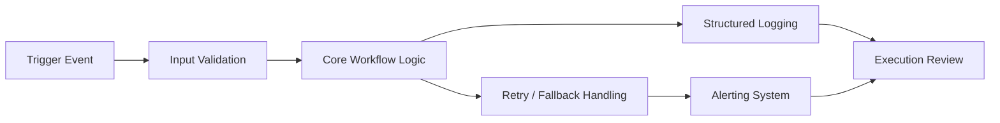

# automation-observability-testing

Production-grade observability, testing, alerting, and failure-handling patterns for workflow automation systems.

🚧 **Project Status: Active Development**

This repository is an ongoing project focused on documenting and improving production-grade automation reliability practices.

New materials are added as additional patterns, testing strategies, and observability techniques are developed and validated in real-world automation systems.

Planned additions include:

* additional workflow observability examples
* automation reliability scorecards
* alert routing architectures
* synthetic workflow testing strategies
* expanded automation incident response playbooks

Contributions, feedback, and suggestions are welcome as the framework continues to evolve.

---

## Overview

Most automation portfolios show how to build workflows.

This repository shows how to make them **reliable in production**.

It covers the operational systems required to safely run automations at scale, including:

* workflow testing
* input and output validation
* structured logging
* retry logic
* fallback paths
* failure alerting
* deployment readiness checks
* incident response and postmortems

The goal is simple:

> Build automations that are not only useful — but trustworthy.

---

## What this demonstrates

This repository demonstrates practical production thinking for automation systems, including:

* reliability engineering mindset
* workflow QA discipline
* operational monitoring design
* failure recovery planning
* system documentation standards

These are the habits required to move from **“it works once” automation** to **production-safe automation systems**.

---

## Why this repo exists

Automation failures are expensive.

A broken API call, malformed webhook payload, duplicate row insert, bad credential, or silent workflow timeout can create lost leads, broken internal processes, and hours of manual cleanup.

This repository documents a practical framework for reducing those risks.

It is designed for:

* n8n workflows
* webhook-based automations
* API orchestration systems
* spreadsheet-backed content pipelines
* internal operations automations
* lead routing and notification systems

---

## Core ideas

### 1. Observability first

If a workflow fails and nobody sees it, the workflow is not production-ready.

### 2. Test critical paths

Every workflow should have test cases for:

* happy path
* bad input
* missing fields
* external API failure
* duplicate processing

### 3. Log structured data

Logs should make it possible to answer:

* what ran
* when it ran
* what input it received
* what output it produced
* where it failed
* whether a retry succeeded

### 4. Design for failure

Every automation should define:

* retry policy
* fallback behavior
* alert trigger conditions
* manual recovery steps

### 5. Review incidents systematically

Failures should produce reusable learning — not repeated chaos.

---

## Production Reliability Principles

Reliable automations are not defined by how often they succeed —
they are defined by **how well they behave when something fails.**

The following principles guide the design of every automation system documented in this repository.

### 1. Fail visibly

Silent failures are the most dangerous form of automation failure.

Every workflow should expose failures through logs, alerts, or monitoring dashboards so that issues can be detected quickly.

### 2. Validate inputs aggressively

Most workflow failures originate from unexpected input.

Automations should validate:

* required fields
* data types
* timestamp formats
* payload structure

before executing downstream logic.

### 3. Design for idempotency

Automations should be safe to retry.

Operations that create records, update rows, or send messages should be designed so that repeated executions do not create duplicate side effects.

### 4. Log structured execution data

Logs should provide enough context to reconstruct what happened during any workflow run.

Minimum logging fields should include:

* workflow name
* run ID
* execution timestamp
* trigger source
* execution result
* error summary if applicable

### 5. Retry transient failures

External systems occasionally fail.

Automations should retry failures caused by:

* network interruptions
* rate limits
* temporary service outages

using exponential backoff and retry limits.

### 6. Escalate critical failures

Failures that impact critical processes should trigger alerts.

Alert payloads should include:

* workflow name
* environment
* run ID
* timestamp
* failed step
* short error summary

### 7. Document recovery procedures

Every automation should have a documented process for:

* manual recovery
* replaying failed jobs
* identifying corrupted records
* restoring system health

## Observability Flow

The following diagram represents a standard reliability flow for production automations.

Every workflow should pass through validation, logging, retry handling, and alerting before final review.



### Flow Explanation

**Trigger Event**
An automation begins when a webhook, schedule, or external event activates the workflow.

**Input Validation**
Incoming payloads are validated to ensure required fields and formats are correct before processing.

**Core Workflow Logic**
The main automation tasks execute here, such as API requests, spreadsheet updates, database writes, or message notifications.

**Structured Logging**
Every run records structured information including run ID, timestamps, payload summaries, and execution results.

**Retry / Fallback Handling**
Transient failures such as API timeouts or rate limits trigger controlled retry logic or fallback actions.

**Alerting System**
Critical failures trigger alerts through channels like Slack, email, or monitoring dashboards.

**Execution Review**
Logs and alerts are reviewed to diagnose failures, verify successful runs, and improve system reliability.

---

## Repository structure

```
automation-observability-testing/
│
├── README.md
├── docs/
│   ├── observability-framework.md
│   ├── automation-testing-checklist.md
│   ├── incident-response-playbook.md
│   ├── retry-and-fallback-patterns.md
│   └── deployment-readiness-checklist.md
│
├── examples/
│   ├── webhook-validation-example.md
│   ├── google-sheets-qa-example.md
│   ├── api-failure-handling-example.md
│   └── alerting-workflow-example.md
│
├── templates/
│   ├── run-log-schema.json
│   ├── error-log-schema.json
│   ├── pre-deploy-checklist.md
│   ├── postmortem-template.md
│   └── workflow-test-case-template.md
│
└── assets/
    └── observability-diagram.png
```

---

## Included documentation

**Observability Framework**
A practical model for instrumenting and monitoring automations.

**Automation Testing Checklist**
A repeatable checklist for validating workflows before production deployment.

**Incident Response Playbook**
A process for triaging, containing, fixing, and documenting automation failures.

**Retry and Fallback Patterns**
Common approaches for handling flaky APIs, rate limits, and partial failures.

**Deployment Readiness Checklist**
A final review before shipping an automation into production.

---

## Who this is for

This repository is useful for:

* automation engineers
* no-code / low-code builders
* operations teams
* founders running lean internal systems
* creators building automated content workflows
* anyone deploying API-based workflows in production

---

## Example use cases

* Validate inbound webhook payloads before processing
* Prevent duplicate Google Sheets inserts
* Retry transient API failures safely
* Alert when a workflow silently stops running
* Log automation runs in a structured format
* Standardize postmortems after incidents

---

## Philosophy

The difference between a **demo automation** and a **production automation** is operational discipline.

This repository documents the operational discipline required to build automations that can be trusted.

---

## Next improvements

Planned additions include:

* sample n8n error-handling workflows
* automation health dashboards
* synthetic workflow testing examples
* alert routing systems
* automation reliability scorecards

---

## License

MIT
